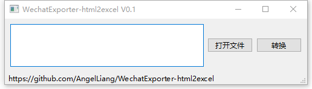
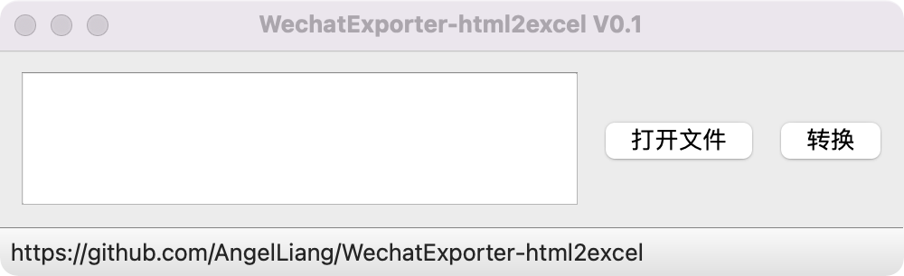

# WechatExporter-html2excel

基于 [WechatExporter](https://github.com/BlueMatthew/WechatExporter) 导出微信聊天记录，HTML转换Excel工具

使用 WechatExporter 工具导出HTML格式的聊天记录后，转换为Excel格式，以便于分析聊天数据。

## 支持平台

Windows 10

Mac

## 使用说明

0. 由于导出的HTML是动态页面，需要下拉滚动才能加载后面的数据，所以需要先把导出的HTML另存为完整的HTML文件，再使用本工具转换成excel   
1. 点击打开文件，选择对应的聊天记录HTML文件
2. 点击转换，然后在HTML文件的同目录下可以看到转换的excel文件

## 开发环境

- Windows 10 OR Mac
- Python 38+

1. 安装python38以上版本的python
2. 安装poetry包管理工具：`pip3 install poetry`
3. 在本项目的主目录下使用poetry搭建python虚拟环境：`poetry install`
4. 进入python虚拟环境：`poetry shell`
5. 运行`python main.py`启动程序

## 格式说明

转换后的Excel格式如下

| <时间>              | <昵称> | <聊天内容> |
| ------------------- | ------ | ---------- |
| 2021-06-18 20:38:03 | 昵称   | 聊天内容   |

## 注意事项

- 自己的发言（聊天框右侧）暂时不会导出
- 图片无法导出到Excel
